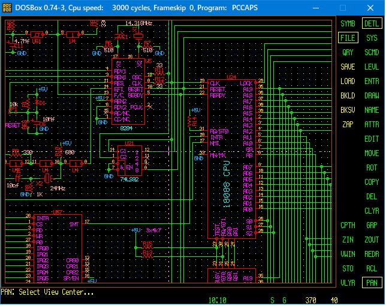

# IBM-PC-TX-v1.0
IBM PC/XT clone, 1991 year




## Клон IBM PC/XT
Архив содержит папку DOS которую в dosbox нужно примонтировать как диск С:
mount c путь\dos
На диске C появятся каталоги

\IBM - файлы схемы и платы

\LIB - библиотека компонентов

\EXE - тут PCAd 4.5

### О проекте:
Это мой клон какого-то клона IBM PC/XT
Схемы рисовались и разводились в 1991 году, в PCAD 4.5 на 286 компе с 12 MHz тактовой.
Элементная база - из того, что можно было тогда достать, из того и делали.
Было сделано до 2-х десятков плат. Сохранилась только одна, в недособранном состоянии.

PAL16R6A - это чтобы просто так не копировали. На самом деле вместо неё стоял какой-то регистр 555ИР22 или ИР33, сейчас уже не помню. 

### BOM.TXT
```
Элемент       аналог       кол-во    примечание
i8088         1810ВМ88        1      на панельке
i8087         1810BM87        1      не обязательно
i8284         1810ГФ84        1
i8288         1810ВГ88        1
i8237         1810ВТ37        1
i8259         1810ВН59        1
i8253         580ВИ53         1       1810ВИ54
i8255         580ВВ55         1
i2764         573РФ4,6        1       содержит BIOS,на панельке
SN74LS00      555ЛА3          1
SN74LS04      555ЛН1          2
SN74LS07      555ЛП9          1
SN74LS08      555ЛИ1          1
SN74LS10      555ЛА4          1
SN74LS14      555ТЛ2          1
SN74LS27      555ЛЕ4          1
SN74LS32      555ЛЛ1          1
SN74LS74      555ТМ2          2
SN74LS92      555ИЕ4          1
SN74LS138     555ИД7          1
SN74LS158     555КП14         1
SN74LS175     555ТМ8          1
SN74LS373     555ИР22         3
SN74LS244     555АП5          5
SN74LS245     555АП6          4
SN74LS299     555ИР24         1
SN74LS670     555ИР26         1       155ИР32,155РП1
SN74S00       531ЛА3          1
SN74S08       531ЛИ1          2
SN74S10       531ЛА4          1
SN74S20       531ЛА1          1
SN74S74       531ТМ2          2
SN74S155      531ИД4          1
SN74S157      531КП11         1       531КП16,531КП14
SN74S280      531ИП5          1
3230          556РТ4          1       Программируется
PAL16R6A                      1       ПЛМ Программируется, в комплекте с платой
RP            НР1-1-9         3       набор резисторов 1 - 4,7ком
CF            КМ5,КМ6        66       Блокировочные конденсаторы 0,068-0,68мкф
NR            МЛТ0.125       18       резистор 22-36ом
SW2           ВДМ1-8          1       набор переключателей в DIP корпусе
J1-J8                         8       разьемы расширения
            К50-35 47мк 16в  13
            К50-35 4,7мк 16в  1
            К50-35 10мк 16    1
X1          14,318 Мгц        1
X2          24-32  Мгц        1       Для режима "Turbo"
```

